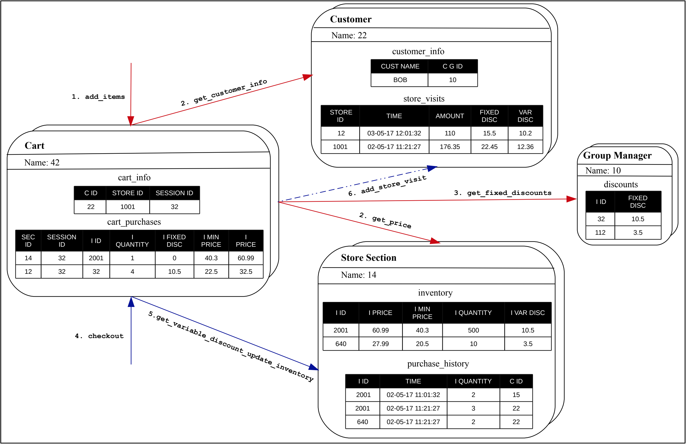

# Meeting Minutes

30.04.2018

Participants:

- Sebastian Schmidl
- Frederic Schneider

## Agenda

1. Scala Intro and IDE setup
   - look into book _Programming Scala_ (O'Reilly)
2. Sync of understanding of paper _Reactors: A Case for Predictable, Virtualized Actor Database Systems_
3. Recap tasks
   - [x] Sebi: create doc folder structure & upload meeting notes
   - [x] Sebi: create issue labels
   - [x] Sebi: create Hello-World in akka
   - [x] Sebi: intro to akka
   - [x] Fred: intro in scala, akka (scala, but not akka)
4. Work on Project (see [below](#Decisions))
5. Next tasks
   - [ ] Fred: intro in akka
   - [ ] implement in-memory data store using defined _Relation_ semantics below
   - [ ] develop a way to declare a `Relation`, which uses the data store
   - [ ] `Relation` should provide default SQL methods: select, update, delete, insert
   - [ ] there are two kinds of `Relation`: `ColumnStoreRelation` and `RowStoreRelation`
6. Next meeting
   - Montag, 30.04.2018 9:15am, on-campus

## Decisions

- We change example from _Police Data Model_ to _Shopping Cart_ from manifest paper
  - better communication to other teams
  - already decomposed to domain entities

  

- Paper _Reactors: A Case for Predictable, Virtualized Actor Database Systems_ provides good insights for implementing our Framework idea
- We want to consider following concepts:
  1. 
  
     > A reactor is an application-defined logical actor that encapsulates state abstracted using relations.
     >
     > _Reactor_ paper

  2. Computations across logical actors have transactional guarantees. _We have to figure out which_.

- _Relation_: How to store relations in-memory?
  - is a named set of tuples
  - [StackOverflow post about typed map with different types](https://stackoverflow.com/questions/17684023/different-types-in-map-scala)
  - implementation ideas: https://hpi.slack.com/files/U7FTCE45N/FAF3HEE3B/image_uploaded_from_ios.jpg